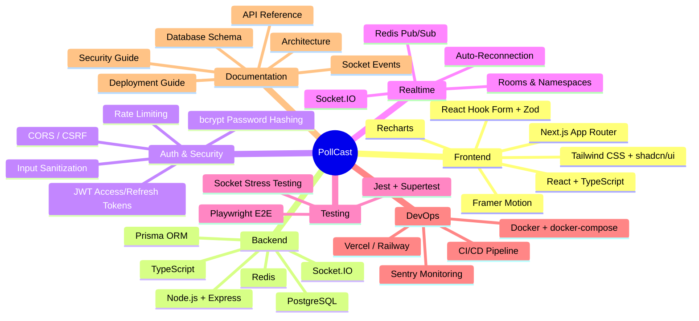
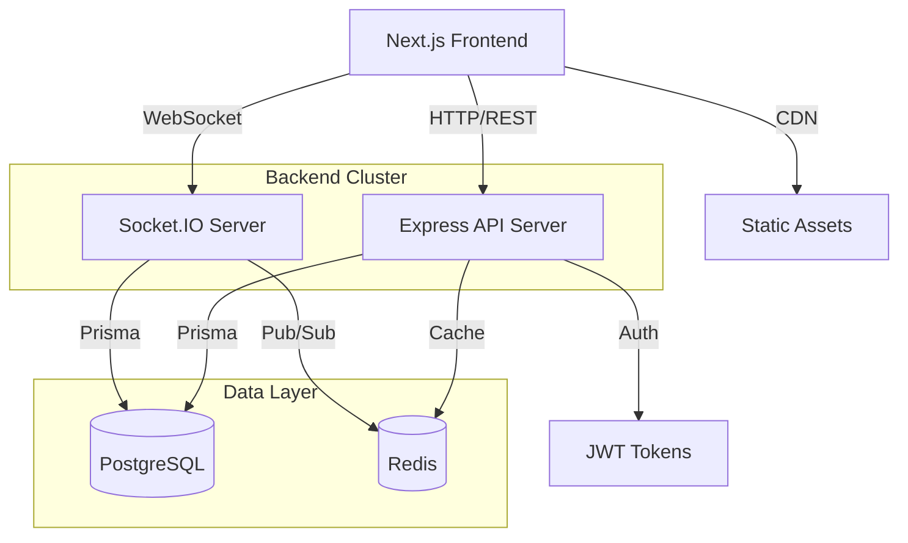

# PollCast — Real-Time Live Polling & Q&A Platform

> A modern, production-grade platform for live events — enabling hosts to create interactive polls and Q&A sessions with real-time audience participation.



## Architecture Overview



## Tech Stack & Justification

| Layer | Technology | Why |
|-------|-----------|-----|
| **Frontend** | Next.js 14+ (App Router) | SSR, RSC, file-based routing, SEO, great DX |
| **UI** | Tailwind CSS + shadcn/ui | Utility-first + pre-built accessible components |
| **Forms** | React Hook Form + Zod | Performant forms with schema validation |
| **Animations** | Framer Motion | Declarative animations, layout animations |
| **Charts** | Recharts | React-native charting, composable |
| **Backend** | Express.js (separate server) | Socket.IO requires persistent server; not suited for serverless |
| **Database** | PostgreSQL + Prisma | Relational integrity, type-safe queries, migrations |
| **Cache/Broker** | Redis | Session store, rate limiting, Socket.IO pub/sub |
| **Realtime** | Socket.IO with Redis adapter | Auto-reconnection, rooms, fallback transport, battle-tested |
| **Auth** | JWT (access + refresh tokens) | Stateless, works across frontend/backend/Socket.IO |
| **Testing** | Jest, Supertest, Playwright | Unit, integration, and E2E coverage |

## Why Separate Backend?

Next.js API routes are serverless — they don't maintain persistent connections. Socket.IO requires a long-running server process. A separate Express server gives us:

- Full control over WebSocket lifecycle
- Persistent connections across restarts
- Horizontal scaling with Redis pub/sub
- Decoupled deployment (frontend on Vercel, backend on Railway/Render)

## Core Features

- **Authentication**: Signup, login, logout, secure sessions, password reset, email verification
- **Role Management**: Admin, Host, Participant with granular permissions
- **Event Management**: Create, edit, delete, schedule events; password protection; invite links; expiration
- **Live Polling**: Single/multi-choice polls, timers, auto-close, instant results, poll history
- **Q&A System**: Ask questions (anonymous option), upvote, moderator approval, pin, delete spam
- **Realtime**: Instant updates via Socket.IO — new participants, polls, votes, results, questions
- **Analytics Dashboard**: Participant count, active users, votes per poll, engagement metrics, event summary
- **Responsive UI**: Fully responsive with dark/light mode, skeleton loaders, smooth transitions

## Project Structure

```
pollcast/
├── apps/
│   ├── web/                   # Next.js frontend
│   │   ├── app/               # App Router pages
│   │   ├── components/        # React components
│   │   │   ├── ui/            # shadcn/ui components
│   │   │   ├── layout/        # Layout components
│   │   │   ├── auth/          # Auth forms
│   │   │   ├── events/        # Event components
│   │   │   ├── polls/         # Poll components
│   │   │   ├── questions/     # Q&A components
│   │   │   └── analytics/     # Dashboard components
│   │   ├── hooks/             # Custom React hooks
│   │   ├── lib/               # Client utilities
│   │   ├── services/          # API service layer
│   │   ├── store/             # State management
│   │   └── types/             # TypeScript types
│   │
│   └── server/                # Express backend
│       └── src/
│           ├── config/        # App configuration
│           ├── controllers/   # Route controllers
│           ├── routes/        # API route definitions
│           ├── services/      # Business logic
│           ├── repositories/  # Data access layer
│           ├── middlewares/    # Express middlewares
│           ├── validators/    # Request validation
│           ├── sockets/       # Socket.IO handlers
│           ├── events/        # Event emitters/handlers
│           ├── db/            # Database connection
│           └── utils/         # Helper utilities
│
├── packages/
│   ├── shared/                # Shared types & constants
│   ├── ui/                    # Shared UI components
│   └── config/                # Shared configuration
│
├── prisma/                    # Prisma schema & migrations
├── tests/
│   ├── unit/                  # Unit tests
│   ├── integration/           # Integration tests
│   └── e2e/                   # Playwright E2E tests
│
├── docker/                    # Dockerfiles
├── scripts/                   # Build & dev scripts
├── docs/                      # Documentation
├── .env.example
├── docker-compose.yml
└── README.md
```

## Quick Start

```bash
# Clone the repository
git clone https://github.com/your-org/pollcast.git
cd pollcast

# Install dependencies
npm install

# Set up environment variables
cp .env.example .env

# Start PostgreSQL and Redis (Docker)
docker compose up -d postgres redis

# Run database migrations
npx prisma migrate dev

# Start development servers
npm run dev
```

## Environment Variables

| Variable | Description | Required |
|----------|-------------|----------|
| `DATABASE_URL` | PostgreSQL connection string | Yes |
| `REDIS_URL` | Redis connection string | Yes |
| `JWT_SECRET` | JWT signing secret | Yes |
| `JWT_REFRESH_SECRET` | Refresh token secret | Yes |
| `NEXT_PUBLIC_API_URL` | Backend API URL | Yes |
| `NEXT_PUBLIC_SOCKET_URL` | Socket.IO server URL | Yes |
| `SMTP_HOST` | Email server host | For email features |
| `SENTRY_DSN` | Sentry error tracking | Optional |

## Deployment

- **Frontend**: Vercel (Next.js optimized)
- **Backend**: Railway / Render (Dockerized Express server)
- **Database**: Railway PostgreSQL / Aiven
- **Redis**: Upstash / Redis Cloud
- **Monitoring**: Sentry + structured logging

## License

MIT
